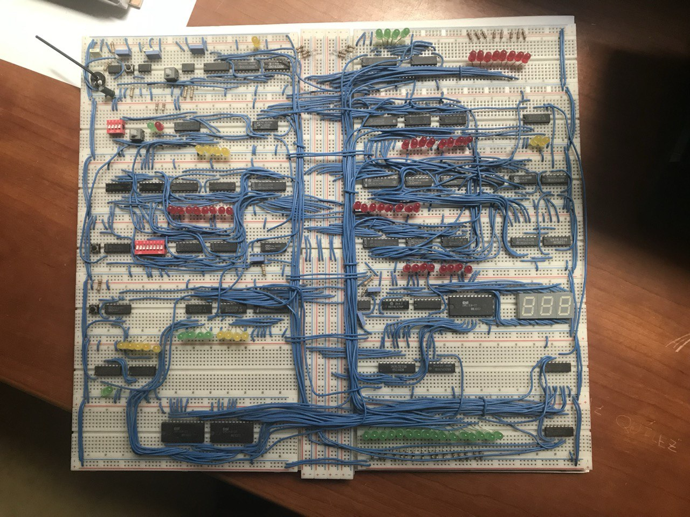
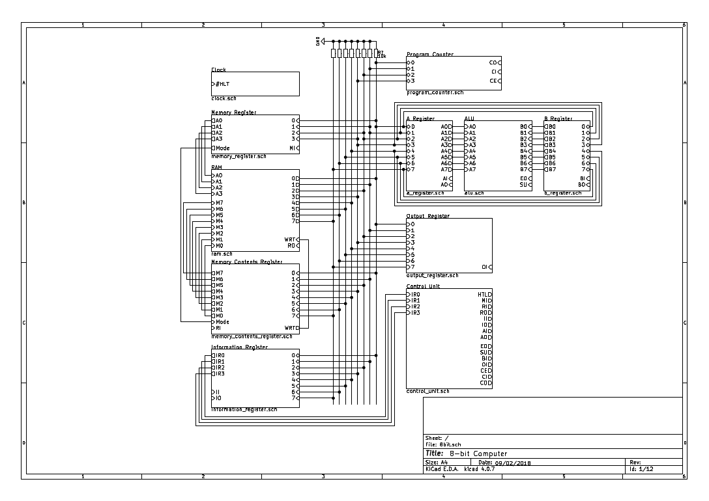

# 8-bit

In early 2018, I built an 8-bit computer following [Ben Eater's tutorial](https://youtu.be/HyznrdDSSGM?feature=shared). I also made schematics for the full project. This is a compilation of the documents that survived until 2025.

## Schematics

I made the schematics with KiCad. Only the pdfs of the schematics have survived. The actual KiCad files have perished.

## Programs

The computer is Turing complete, so it can run any 8-bit program. In 2025, however, I only have two presentable recordings of the project and they both are of a program that increments and decrements a variable.
